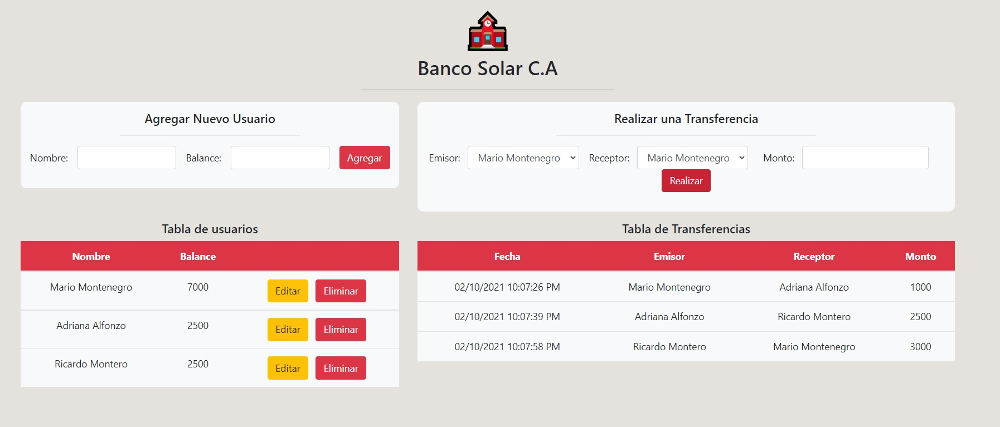

# Prueba - Banco Solar

El sistema debe permitir registrar nuevos usuarios con un balance inicial y basados en éstos, realizar transferencias de saldos entre ellos.

El servidor deberá disponibilizar las siguientes rutas:

- **/ GET**: Devuelve la aplicación cliente disponible en el apoyo de la prueba.
- **/usuario POST**: Recibe los datos de un nuevo usuario y los almacena en PostgreSQL.
- **/usuarios GET**: Devuelve todos los usuarios registrados con sus balances.
- **/usuario PUT**: Recibe los datos modificados de un usuario registrado y los actualiza.
- **/usuario DELETE**: Recibe el id de un usuario registrado y lo elimina .
- **/transferencia POST**: Recibe los datos para realizar una nueva transferencia. Se debe
  ocupar una transacción SQL en la consulta a la base de datos.
- **/transferencias GET**: Devuelve todas las transferencias almacenadas en la base de
  datos en formato de arreglo.

## Comenzando 🚀

_Estas instrucciones te permitirán obtener una copia del proyecto en funcionamiento en tu máquina local para propósitos de desarrollo y pruebas._

- $ git clone https://github.com/krakerbrain/prueba_banco_solar
- $ cd ../path/to/the/file
- $ npm install

### Requerimientos

1. Utilizar el paquete pg para conectarse a PostgreSQL y realizar consultas DML para la
   gestión y persistencia de datos.
2. Usar transacciones SQL para realizar el registro de las transferencias.
3. Servir una API RESTful en el servidor con los datos de los usuarios almacenados en
   PostgreSQL.
4. Capturar los posibles errores que puedan ocurrir a través de bloques catch o
   parámetros de funciones callbacks para condicionar las funciones del servidor.
5. Devolver correctamente los códigos de estado según las diferentes situaciones.

##### La aplicación debe verse así:

#### Notas de construcción:

- Para obtener el id en consultas de transferencias se modifico el valor del atributo values de la etiqueta [<option>]
  (revisar línea 240 y 241 de index.html)
- Se implementó validación para evitar que se hagan transferencias entre un mismo usuario
  (revisar línea 197 de index.html)
- Se implementa módulo Singleton para usar solo una instancia de pool
- En todas las consultas se usa el ID del usuario, que es la mejor forma de evitar que, por ejemplo,
  al existir usuarios con el mismo nombre, se repitan datos en la BD

## Construido con 🛠️

- [nodeJS](https://nodejs.org/en/)

#### Usando las librerías:

- [node-postgres](https://node-postgres.com/api/pool)
- [http](https://nodejs.org/api/http.html)
- [fileSystem](https://nodejs.org/api/fs.html)
- [url](https://nodejs.org/api/url.html)

## Autor ✒️

- **Mario Montenegro**
